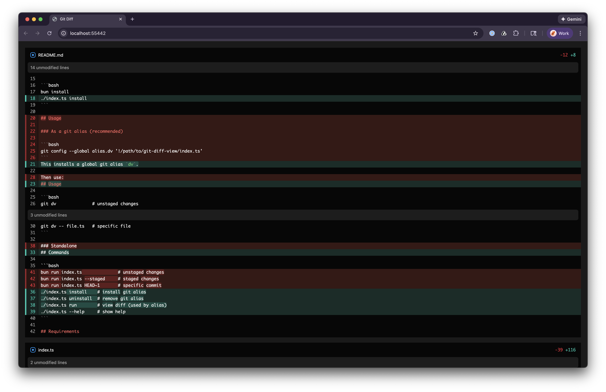

# git-diff-view

A beautiful, browser-based git diff viewer with syntax highlighting and automatic dark/light theme detection.



## Why git-diff-view?

Terminal diffs are hard to read. `git-diff-view` opens your diffs in a beautiful browser interface with:

- **Word-level highlighting** — see exactly which characters changed, not just which lines
- **Automatic theme detection** — seamlessly matches your system's light or dark mode
- **Unified diff layout** — familiar, easy-to-scan format with colored addition/deletion bars
- **Multi-file support** — review all your changes in a single scrollable view
- **Zero configuration** — works out of the box

Powered by [@pierre/diffs](https://diffs.com/).

---

## Installation

### Prerequisites

- [Bun](https://bun.sh) — install with `curl -fsSL https://bun.sh/install | bash`
- macOS (uses native `open` command and theme detection)

### Quick Start

```bash
# Install globally
bun install -g git-diff-view

# Install the git alias
git-diff-view install
```

Or with npm:

```bash
npm install -g git-diff-view
git-diff-view install
```

That's it. You now have a `git dv` command available in any repository.

---

## Usage

### As a git alias (recommended)

After installation, use `git dv` anywhere you'd use `git diff`:

```bash
git dv                  # View unstaged changes
git dv --staged         # View staged changes
git dv HEAD~1           # View last commit
git dv HEAD~3           # View last 3 commits
git dv main..feature    # Compare branches
git dv -- src/app.ts    # View changes to a specific file
```

### Standalone commands

```bash
./index.ts install      # Install the git dv alias
./index.ts uninstall    # Remove the git dv alias
./index.ts run          # Run the diff viewer directly
./index.ts --help       # Show help
```

---

## How It Works

1. `git dv` captures the output of `git diff` with your arguments
2. A local server spins up and parses the diff
3. Your browser opens to a React-powered diff viewer
4. The server automatically shuts down after 3 seconds

---

## Uninstall

```bash
git-diff-view uninstall
bun remove -g git-diff-view
```

---

## License

MIT
